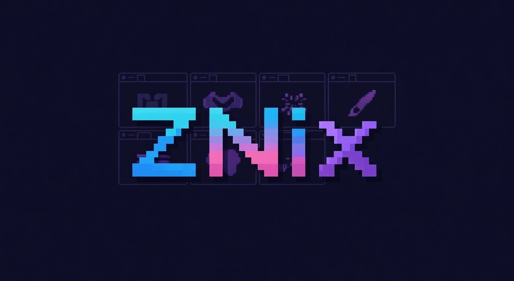
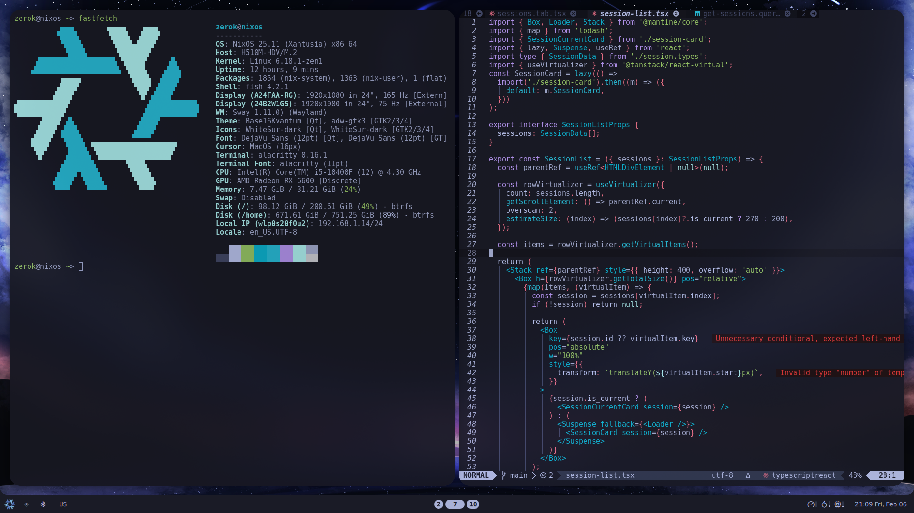
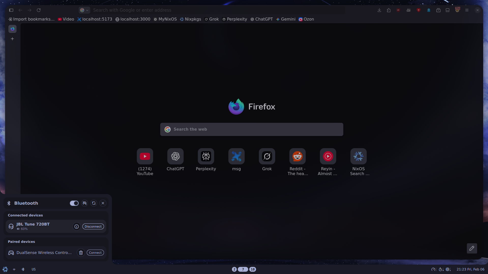

# ZNix Documentation

  <a href="README.md">English</a> |
  <a href="docs/ru.md">Русский</a> |
  <a href="docs/uk.md">Українська</a> |
  <a href="docs/es.md">Español</a> |
  <a href="docs/de.md">Deutsch</a> |
  <a href="docs/fr.md">Français</a> |
  <a href="docs/pt-br.md">Português (BR)</a> |
  <a href="docs/zh-CN.md">中文</a>

NixOS/home-manager configuration set split by host. Below: what lives where, custom options, hardware notes, and how to reuse or add a host.

## Highlights
- SwayFX preconfigured with Noctalia Shell (panel/bar, outputs, autostart).
- Neovim via nixvim with plugins for LSP, completion, Treesitter UI, DAP.
- Stylix theme with custom cursors/icons and GTK/fzf/lazygit/noctalia targets.
- Optional SillyTavern + Ollama module and a ready LAN dev-ports module.

## Examples

- `fastfetch` + nixvim: 
- Firefox + Bluetooth + Noctalia: 

## Layout
- `flake.nix`: entry; pulls nixpkgs 25.11, home-manager, nixvim, stylix, noctalia, firefox-nightly, flake-parts.
- `hosts/desktop`, `hosts/laptop`: nixosSystem entry points; import `configuration.nix`, host `hardware-configuration.nix`, host modules (ollama, fprintd/opencode) and HM for user `zerok`.
- `configuration.nix`: base system stack; imports `core/` and `configs/`.
- `core/`: system modules (boot, nixpkgs, networking, audio, graphics, users, etc.) plus `znix/` for custom options.
- `configs/`: extra tweaks (e.g., `throne.nix`, `zapret.nix`).
- `home/`: home-manager config for `zerok`; includes swayfx (`home/sway/`), packages, themes, nixvim (`home/nixvim/`), etc.

## Custom options
- System:
  - `znix.monitors.*` (`home/znix/monitors.nix`): monitor mode/position map and Noctalia bar targets (defined at HM level).
  - `znix.dev.ports.*` (`core/znix/ports.nix`): open dev TCP ports on a chosen interface (`interface`, `tcpPorts`).
  - `znix.ai.sillytavern.*` (`core/znix/silly-tavern.nix`): toggle SillyTavern and Ollama (`enable`, `ollamaEnable`, `mobileServer`, `name`).
  - `znix.hardware.fingerprint.goodix.*` (`core/znix/finger-print.nix`): enable Goodix fprintd/TOD driver.
- Home:
  - `znix.browser.*` (`home/znix/browser.nix`): Firefox profile/extension/bookmark options.
  - `znix.theme.*` (`home/znix/theme.nix`): theme polarity, cursor package, icon package/names for stylix.

## Hardware-configuration warning
- `hosts/*/hardware-configuration.nix` files are machine-specific; **replace them** with your own (typically from `/etc/nixos/hardware-configuration.nix` after install).
- Avoid committing foreign hardware configs; keep yours local or private.

## Using existing hosts
1) Install NixOS and enable flakes (`nix.settings.experimental-features = [ "nix-command" "flakes" ];`).
2) Clone the repo and swap `hosts/<target>/hardware-configuration.nix` with yours.
3) Build: `sudo nixos-rebuild switch --flake .#desktop` (or `.#laptop`).
4) Quick build check without switching: `nix build .#nixosConfigurations.desktop.config.system.build.toplevel --no-link`.

## Adding a new host
1) Copy an existing `hosts/<name>/` directory and drop in your `hardware-configuration.nix`.
2) In the new `default.nix`, set the right `system` and enable needed modules/overlays.
3) Adjust HM specifics (noctalia bar position, font scale, display layout, etc.).
4) Build: `nix build .#nixosConfigurations.<name>.config.system.build.toplevel --no-link` or `sudo nixos-rebuild switch --flake .#<name>`.

## Notes
- home-manager lives inside the NixOS modules (no separate `homeConfigurations` output).
- New modules must be added explicitly to the relevant `default.nix` files (no auto-import).
